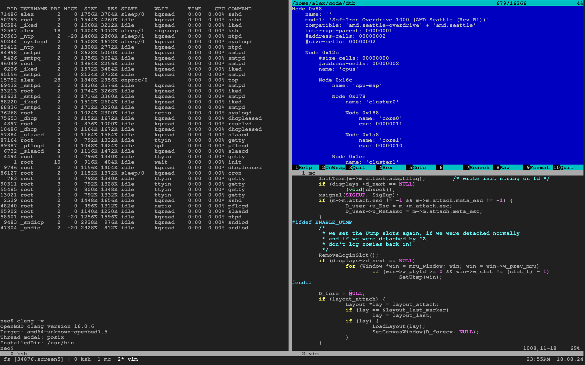

#  GNU Screen - screen manager with VT100/ANSI terminal emulation

Screen is a full-screen window manager that multiplexes a physical
terminal between several processes (typically interactive shells).
Each virtual terminal provides the functions of a DEC VT100 terminal
and, in addition, several control functions from the ISO 6429
(ECMA 48, ANSI X3.64) and ISO 2022 standards (e.g. insert/delete
line and support for  multiple character sets).
There is a scrollback history buffer for each virtual terminal and
a copy-and-paste mechanism that allows moving text regions between
windows.

This project is just a sandbox for experiments with screen's sources.
Please use official GNU git-repo. Source code here can be *very* broken.
